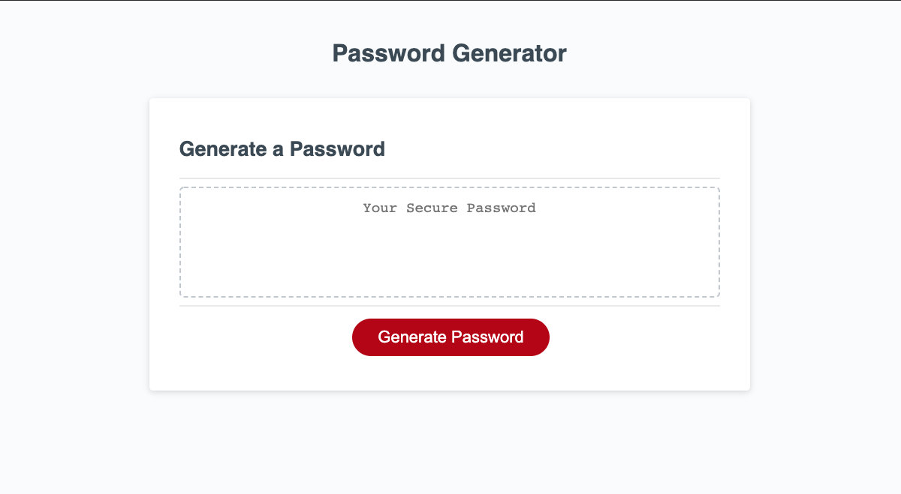
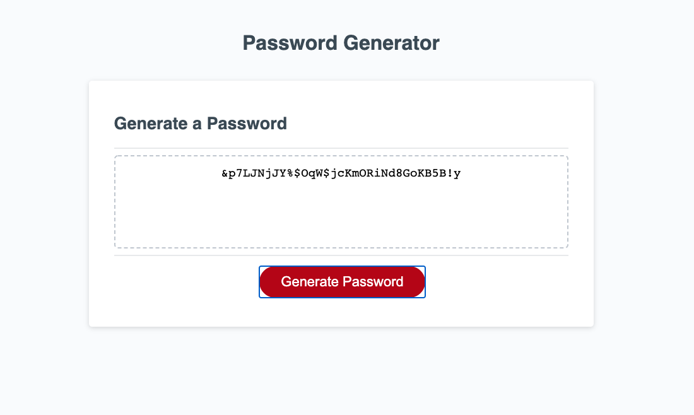

# Password Generator

## Purpose
Password Generator is an application that allows a user to generate a random password. This application is especially useful if the user's goal is to create a strong and secure password that cannot be guessed easily. The user can create a password with a length between 8 and 128 characters. The application randomly generates a password using the selected length, comprised of at least one of the following character-types: lower case letters, upper case letters, numbers, or an assortment of special characters. If the user selects an inappropriate length, or fails to choose at least one character type when prompted, they will be prompted to make a valid selection. 

## Built With:
* JavaScript
* HTML
* CSS

## Website
https://gwarzecha.github.io/password-generator/

## Creating the Application
This was the first application that I have developed using JavaScript. It was challenging and presented quite a learning curve compared to developing with exclusively HTML and CSS. Particularly challenging was mapping out the JS structure to execute the application properly. I found myself utilizing a large amount of pseudocode and breaking down the overall task into smaller chunks. Once I was able to isolate various portions of the desired application functionality into workable bits, I was able to code the program more effeciently. Overall, the application is still nowhere near the DRY-est it can be, but I plan to revisit it as I gain more JS knowledge and continue to become a more efficient and seasoned developer. 

